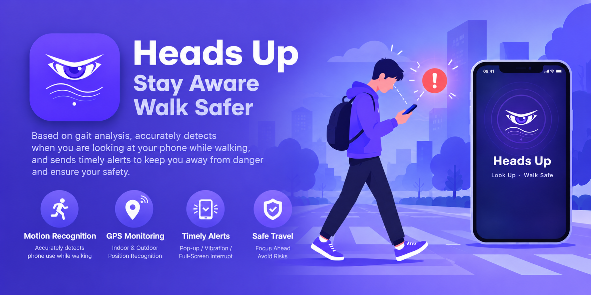

**English** | [简体中文](README.zh-CN.md)

<p align="center">
  
</p>

# Heads Up

A general-purpose Android "Heads Up" app with a modern Material You design. It automatically reminds you to look up from your phone while walking (including stairs).

  > ⚠️ Background restriction policies on some customized ROMs can disconnect sensor connections. Please allow this app in “Background config / High background power consumption” and lock it in recent tasks, otherwise walking and phone-use detection may stop working.

## Features

- **On-device gait detection**: `STEP_DETECTOR` as the primary pipeline, fused with accelerometer / gyroscope + proximity sensor, no GMS required
- **False-positive protection**: triggers only after N consecutive steps with consistent rhythm (cadence band + stability check);
  no counting while the screen is off / locked / in pocket, resets after you stop walking; 3 sensitivity levels drive all thresholds
- **Three reminder styles**: Pop-up notification / Floating reminder / Full-screen reminder;
  popup mode uses the overlay permission
- **Mute indoors** (off by default): suppresses reminders when GPS indicates indoors, GPS is not used when the switch is off
- **Outdoor detection**: median of visible strong satellites, prefers good-accuracy GPS fixes,
  indoor verdicts are cached for 30s, unknown is treated as outdoors
- **Live status card**: service heartbeat / consecutive steps / sensors / indoor / satellites (fix / strong / total) / GMS status,
  with a "Simulate walking" end-to-end test
- **GPS battery-saving policy**: real-time on the home screen; in background only samples on demand when "walking and reminder cooldown has elapsed" + reuses passive fixes;
  disconnects when the screen is off / locked / location master switch is off
- **Keep-alive**: boot auto-start, foreground service, vendor auto-start guide, battery whitelist, WorkManager watchdog
- **Multi-language (follows system)**: all UI strings are localized and switch automatically with the system locale via resource qualifiers, supporting English, Simplified Chinese, Traditional Chinese (incl. Hong Kong), Spanish,
  French, German, Italian, Portuguese, Russian, Japanese, Korean, Arabic, Hindi, Indonesian

## Permissions

Physical activity, notifications, location ("Allow all the time" is required for indoor detection; on systems without that option, foreground counts),
overlay (popup mode only), ignore battery optimizations, boot completed, foreground service.

## Build

```bash
./gradlew assembleDebug
```

Requirements: JDK 17, Android SDK (with `platforms;android-34` / `build-tools;34.0.0`),
configure `sdk.dir` in `local.properties`.

## Project Structure

```
app/src/main/java/com/playlab/headsup/
├── MainActivity.kt            # Material You single page: switch/reminder mode/permissions/keep-alive/status card
├── data/Prefs.kt              # Switch/mode/interval/sensitivity/indoor-suppression/permission request records
├── detection/WalkDetector.kt  # Gait detection core (rhythm consistency + amplitude gating)
├── service/
│   ├── HeadsUpService.kt      # Foreground service: detection scheduling/GMS fast path/keep-alive/GPS start-stop
│   ├── ActivityUpdateReceiver.kt
│   └── BootReceiver.kt        # Boot auto-start/revive after kill
├── reminder/
│   ├── ReminderManager.kt     # Three reminder styles (with indoor-suppression gate)
│   └── ReminderActivity.kt    # Full-screen reminder page
├── worker/KeepAliveWorker.kt
└── util/
    ├── IndoorDetector.kt      # GPS indoor detection (visible-strong-satellite median + cache + power-saving scheduling)
    ├── PermissionHelper.kt    # Permission status queries (foreground/background/always allow)
    └── KeepAliveHelper.kt     # Battery whitelist/vendor auto-start
```

```text
app/src/main/res/
├── values/strings.xml         # Default English; falls back here for unsupported languages
├── values-zh-rCN/strings.xml  # Simplified Chinese
├── values-zh-rTW/strings.xml  # Traditional Chinese
├── values-{es,fr,de,it,pt,ru,ja,ko,ar,hi,id,en}/strings.xml
└── xml/locales_config.xml     # Supported language list (follows system)
```

## Notes

Reminders are no substitute for attention — please try to look at your phone less while walking.

## Support

If you find this app useful, feel free to buy the developer a coffee. Your support keeps us maintaining it.

<p align="center">
  <a href="https://ko-fi.com/playlaboratory"></a>
  <a href="https://afdian.com/a/playlab"></a>
</p>
