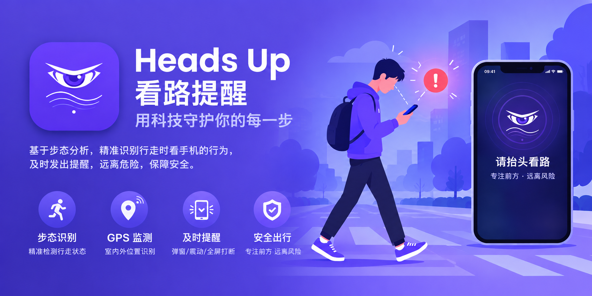

[English](README.md) | **简体中文**

<p align="center">
  
</p>

# 看路提醒 Heads Up

现代化 Material You 设计风格的 Android 通用看路提醒应用。行走（含上下楼梯）时玩手机，自动提醒你抬头看路。

  > ⚠️ 部分定制系统的后台限制策略会断开传感器连接，请在“后台配置 / 高后台耗电”中允许本应用，并将本应用锁定在任务卡片，否则可能导致无法检测步行和用机状态。


## 功能

- **本机步态检测**：`STEP_DETECTOR` 主链路，加速度/陀螺仪 + 距离感应器，不依赖 GMS
- **防误触判据**：连续 N 步节律一致（步频带 + 稳定度校验）才触发；
  锁屏/灭屏/口袋不累计，停走延迟清零；灵敏度三档联动全部阈值
- **三种提醒方式**：浮动通知 / 悬浮窗弹窗 / 全屏提醒；
  弹窗模式使用悬浮窗权限
- **室内不提醒**（默认关）：GPS 判室内则抑制提醒，开关关闭时不使用 GPS
- **户外判断**：可见强星中位数判定，GPS 好精度优先，
  室内结论短效缓存 30s，未知按户外放行
- **实时状态卡**：服务心跳 / 连贯步数 / 传感器 / 室内 / 卫星（定位/强星/总数）/ GMS 状态，
  附“模拟步行”端到端测试
- **GPS 省电策略**：主页实时；后台只在“行走中且提醒冷却已过”时按需采样 + 被动复用；
  息屏/锁屏/定位总开关关闭即断连
- **保活**：开机自启、前台服务、厂商自启动引导、电池白名单、WorkManager 巡检
- **多语言（跟随系统）**：界面文案全部资源化，通过资源限定符跟随系统语言自动切换，支持英语、简体中文、繁体中文（含香港）、西班牙语、
  法语、德语、意大利语、葡萄牙语、俄语、日语、韩语、阿拉伯语、印地语、印度尼西亚语

## 权限

身体活动、通知、位置（室内判断需“始终允许”，不区分的系统以前台为准）、
悬浮窗（仅弹窗模式）、忽略电池优化、开机启动、前台服务。

## 构建

```bash
./gradlew assembleDebug
```

要求：JDK 17，Android SDK（含 `platforms;android-34` / `build-tools;34.0.0`），
`local.properties` 中配置 `sdk.dir`。

## 目录

```
app/src/main/java/com/playlab/headsup/
├── MainActivity.kt            # Material You 单页：开关/提醒方式/权限/保活/状态卡
├── data/Prefs.kt              # 开关/模式/间隔/灵敏度/室内不提醒/权限申请记录
├── detection/WalkDetector.kt  # 步态检测核心（节律一致性+幅度门控）
├── service/
│   ├── HeadsUpService.kt      # 前台服务：检测调度/GMS加速通道/保活/GPS启停
│   ├── ActivityUpdateReceiver.kt
│   └── BootReceiver.kt        # 开机自启/被杀拉活
├── reminder/
│   ├── ReminderManager.kt     # 三种提醒方式（含室内抑制门控）
│   └── ReminderActivity.kt    # 全屏提醒页
├── worker/KeepAliveWorker.kt
└── util/
    ├── IndoorDetector.kt      # GPS 室内判断（可见强星中位数+缓存+省电调度）
    ├── PermissionHelper.kt    # 权限状态查询（前台/后台/始终允许）
    └── KeepAliveHelper.kt     # 电池白名单/厂商自启动
```

```text
app/src/main/res/
├── values/strings.xml         # 默认英文；不支持的语言回退至此
├── values-zh-rCN/strings.xml  # 简体中文
├── values-zh-rTW/strings.xml  # 繁体中文
├── values-{es,fr,de,it,pt,ru,ja,ko,ar,hi,id,en}/strings.xml
└── xml/locales_config.xml     # 支持语言清单（跟随系统）
```

## 说明

提醒不能替代注意力，走路时请尽量少看手机。

## 赞助支持

如果你觉得这个应用对你有帮助，欢迎请开发者喝杯咖啡，你的支持是我们持续维护的动力。

<p align="center">
  <a href="https://ko-fi.com/playlaboratory"></a>
  <a href="https://afdian.com/a/playlab"></a>
</p>
